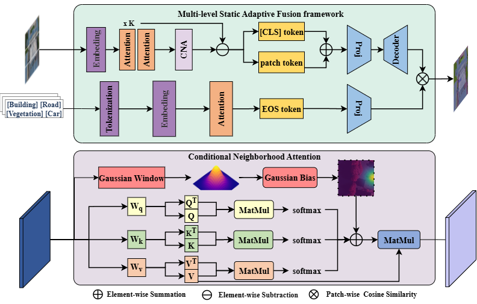
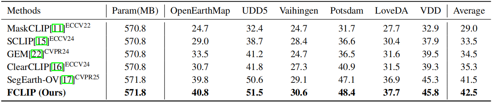
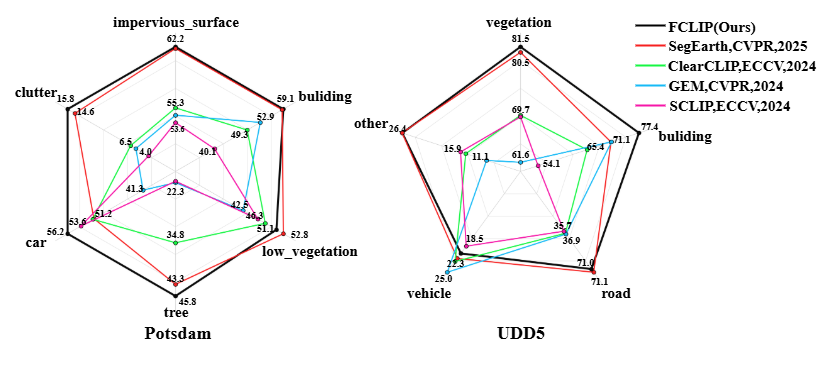
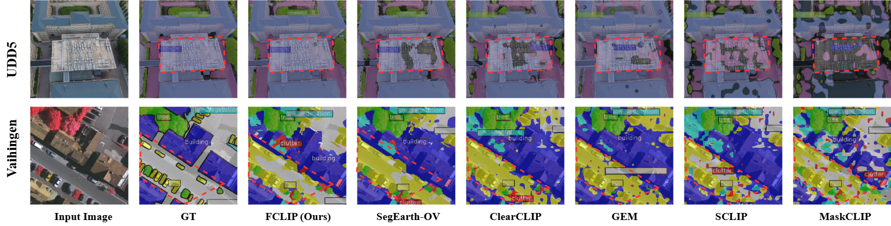

<h1>FCLIP: CLIP-Driven Multi-Level Fusion for Training-Tree Zero-Shot Semantic Segmentation in Remote Sensing Images.</h1>

<p align="center">
    <a href="https://github.com/305840574">Dengji Zhang<sup>1,*</sup></a>,
    <a href="https://github.com/Devin-Egber">Lulin Li<sup>1,*</sup></a>,
    <a href="https://github.com/PreWisdom">Shijie Wang<sup>2</sup></a>,
    <a href="https://github.com/larryjar">Yue Li<sup>3</sup></a>,
    <a href="https://cs.qhu.edu.cn/jxgz/jxysz/szgk/50127.htm">Shiying Wang<sup>1,2,†</sup></a>,
    <a href="https://www.cs.tsinghua.edu.cn/info/1117/3542.htm">Pin Tao<sup>1,3,†</sup></a>
</p>

<p align="center">
    <a href="https://www.qhu.edu.cn/">Qinghai University</a><sup>1</sup>
    •
    <a href="https://rd.qhu.edu.cn/kypt/sbj/sj/35e982434b7249b3914d608d50eb889c.htm/">Qinghai Province Laboratory</a><sup>2</sup>    
    •    
    <a href="https://www.tsinghua.edu.cn/">Tsinghua University</a><sup>3</sup>

<p align="center">
    
</p>

## Abstract
> Open-vocabulary zero-shot semantic segmentation in remote sensing images is critical for natural resource management and ecological monitoring. Existing CLIP-based methods often suffer from reduced accuracy for two reasons: first, a trade-off between global and local features; second, noise from low-level features. We propose Conditional Neighborhood Attention (CNA) to address these issues. It applies Q-Q, K-K, and V-V self-relations in the last attention layer of the CLIP image encoder, using a local Gaussian bias to focus on nearby regions without disrupting the original distribution. Furthermore, we propose a Multi-level Static Adaptive Fusion framework (MSAF) which integrates global, local, and low-level features in a complementary manner. Without training, the framework leverages simple and efficient static weights to preserve global semantic consistency and enhance local discriminability. It also suppresses noise from low-level features. Comprehensive evaluations demonstrate that our method achieves an average of 1.1\% improvement in mIoU over existing state-of-the-art approaches across six benchmark datasets for remote sensing semantic segmentation, and exhibits strong cross-domain generalization capability.

## Dependencies and Installation


```
1. git clone this repository
git clone https://github.com/305840574/FCLIP.git
cd FCLIP
2. install dependencies
conda env create -f FCLIP.yml
conda activate FCLIP
pip install git+https://github.com/likyoo/SimFeatUp.git
```
Tip：If you encounter mmcv compilation errors (e.g., No module named 'mmcv._ext'), uninstall and reinstall using pre-built wheels:
```
pip uninstall mmcv -y
pip install "mmcv==2.1.0" -f https://download.openmmlab.com/mmcv/dist/cu121/torch2.1/index.html
```


## Datasets Preparation
It is recommended to symlink the dataset root to `$FCLIP/data`, The structure of datasets are aligned as follows:
```
FCLIP
├── data
│   ├── OpenEarthMap 
│   │   ├── img_dir
│   │   │   ├── val
│   │   ├── ann_dir
│   │   │   ├── val
│   ├── loveDA
│   │   ├── img_dir
│   │   │   ├── train
│   │   │   ├── val
│   │   │   ├── test
│   │   ├── ann_dir
│   │   │   ├── train
│   │   │   ├── val
│   ├── potsdam
│   │   ├── img_dir
│   │   │   ├── train
│   │   │   ├── val
│   │   ├── ann_dir
│   │   │   ├── train
│   │   │   ├── val
│   ├── vaihingen
│   │   ├── img_dir
│   │   │   ├── train
│   │   │   ├── val
│   │   ├── ann_dir
│   │   │   ├── train
│   │   │   ├── val
│   ├── iSAID
│   │   ├── img_dir
│   │   │   ├── train
│   │   │   ├── val
│   │   │   ├── test
│   │   ├── ann_dir
│   │   │   ├── train
│   │   │   ├── val
│   ├── UDD5 
│   │   ├── train
│   │   │   ├── src
│   │   │   ├── gt
│   │   ├── val
│   │   │   ├── src
│   │   │   ├── gt

```
### OpenEarthMap

The data could be downloaded from [here](https://zenodo.org/records/7223446).

For OpenEarthMap dataset, please run the following command to re-organize the dataset.

```shell
python tools/dataset_converters/openearthmap.py /path/to/OpenEarthMap
```

We only use ``OpenEarthMap_wo_xBD``.

### LoveDA

The data could be downloaded [zenodo](https://zenodo.org/record/5706578#.YZvN7SYRXdF), you should run the following command:

```shell
# Download Train.zip
wget https://zenodo.org/record/5706578/files/Train.zip
# Download Val.zip
wget https://zenodo.org/record/5706578/files/Val.zip
# Download Test.zip
wget https://zenodo.org/record/5706578/files/Test.zip
```

For LoveDA dataset, please run the following command to re-organize the dataset.

```shell
python tools/dataset_converters/loveda.py /path/to/loveDA
```

Using trained model to predict test set of LoveDA and submit it to server can be found [here](https://codalab.lisn.upsaclay.fr/competitions/421).

More details about LoveDA can be found [here](https://github.com/Junjue-Wang/LoveDA).

### ISPRS Potsdam

The [Potsdam](https://www.isprs.org/resources/datasets/benchmarks/UrbanSemLab/2d-sem-label-potsdam.aspx) dataset is for urban semantic segmentation used in the 2D Semantic Labeling Contest - Potsdam.

The dataset can be downloaded on [BaiduNetdisk](https://pan.baidu.com/s/1K-cLVZnd1X7d8c26FQ-nGg?pwd=mseg)，password：mseg, [Google Drive](https://drive.google.com/drive/folders/1w3EJuyUGet6_qmLwGAWZ9vw5ogeG0zLz?usp=sharing) and [OpenDataLab](https://opendatalab.com/ISPRS_Potsdam/download).
The '2_Ortho_RGB.zip' and '5_Labels_all_noBoundary.zip' are required.

For Potsdam dataset, please run the following command to re-organize the dataset.

```shell
python tools/dataset_converters/potsdam.py /path/to/potsdam
```

In our default setting, it will generate 3456 images for training and 2016 images for validation.

### ISPRS Vaihingen

The [Vaihingen](https://www.isprs.org/resources/datasets/benchmarks/UrbanSemLab/2d-sem-label-vaihingen.aspx) dataset is for urban semantic segmentation used in the 2D Semantic Labeling Contest - Vaihingen.

The dataset can be downloaded on [BaiduNetdisk](https://pan.baidu.com/s/109D3WLrLafsuYtLeerLiiA?pwd=mseg)，password：mseg.
The 'ISPRS_semantic_labeling_Vaihingen.zip' and 'ISPRS_semantic_labeling_Vaihingen_ground_truth_eroded_COMPLETE.zip' are required.

For Vaihingen dataset, please run the following command to re-organize the dataset.

```shell
python tools/dataset_converters/vaihingen.py /path/to/vaihingen
```

In our default setting (`clip_size`=512, `stride_size`=256), it will generate 344 images for training and 398 images for validation.

### iSAID

The data images could be download from [DOTA-v1.0](https://captain-whu.github.io/DOTA/dataset.html) (train/val/test)

The data annotations could be download from [iSAID](https://captain-whu.github.io/iSAID/dataset.html) (train/val)

The dataset is a Large-scale Dataset for Instance Segmentation (also have semantic segmentation) in Aerial Images.

You may need to follow the following structure for dataset preparation after downloading iSAID dataset.

```none
├── data
│   ├── iSAID
│   │   ├── train
│   │   │   ├── images
│   │   │   │   ├── part1.zip
│   │   │   │   ├── part2.zip
│   │   │   │   ├── part3.zip
│   │   │   ├── Semantic_masks
│   │   │   │   ├── images.zip
│   │   ├── val
│   │   │   ├── images
│   │   │   │   ├── part1.zip
│   │   │   ├── Semantic_masks
│   │   │   │   ├── images.zip
│   │   ├── test
│   │   │   ├── images
│   │   │   │   ├── part1.zip
│   │   │   │   ├── part2.zip
```

```shell
python tools/dataset_converters/isaid.py /path/to/iSAID
```

In our default setting (`patch_width`=896, `patch_height`=896, `overlap_area`=384), it will generate 33978 images for training and 11644 images for validation.

### UDD5

The data could be downloaded from [here](https://github.com/MarcWong/UDD).


## Quick Inference
```
python demo.py
```

## Model evaluation
```
python eval.py --config ./configs/cfg_DATASET.py --workdir YOUR_WORK_DIR
```
Evaluation on all datasets:
```
python eval_all.py
```

## Results
<p align="center">
    
</p>

## Comparison of per-class IoU 
<p align="center">
    
</p>

## Segmentation Visualization
<p align="center">
    
</p>

## LICENSE

This repo is under the Apache-2.0 license. For commercial use, please contact the authors. 
